1.  Загрузить csv-файлы на HDFS
```hdfs dfs -ls /input```

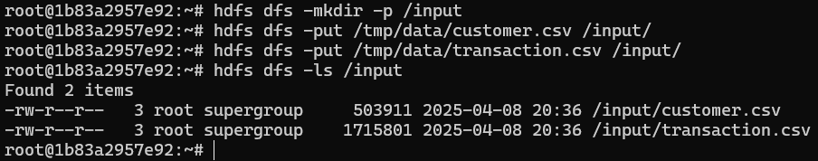


2.  Создать над csv-файлами по 2 таблицы (managed и external). 
    * customer-таблицы

    ```
    CREATE TABLE managed_customer (
        customer_id INT,
        first_name STRING,
        last_name STRING,
        gender STRING,
        DOB STRING,
        job_title STRING,
        job_industry_category STRING,
        wealth_segment STRING,
        deceased_indicator STRING,
        owns_car STRING,
        address STRING,
        postcode STRING,
        state STRING,
        country STRING,
        property_valuation INT
    )
    ROW FORMAT DELIMITED
    FIELDS TERMINATED BY ';'
    STORED AS TEXTFILE
    TBLPROPERTIES ("skip.header.line.count"="1");

    LOAD DATA INPATH '/input/customer.csv' INTO TABLE managed_customer;
    ```

    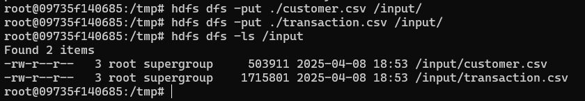

    ```
    CREATE EXTERNAL TABLE external_customer (
    customer_id INT,
    first_name STRING,
    last_name STRING,
    gender STRING,
    DOB STRING,
    job_title STRING,
    job_industry_category STRING,
    wealth_segment STRING,
    deceased_indicator STRING,
    owns_car STRING,
    address STRING,
    postcode STRING,
    state STRING,
    country STRING,
    property_valuation INT
    )
    ROW FORMAT DELIMITED
    FIELDS TERMINATED BY ';'
    STORED AS TEXTFILE
    LOCATION '/input/customer'
    TBLPROPERTIES ("skip.header.line.count"="1");
    ```

    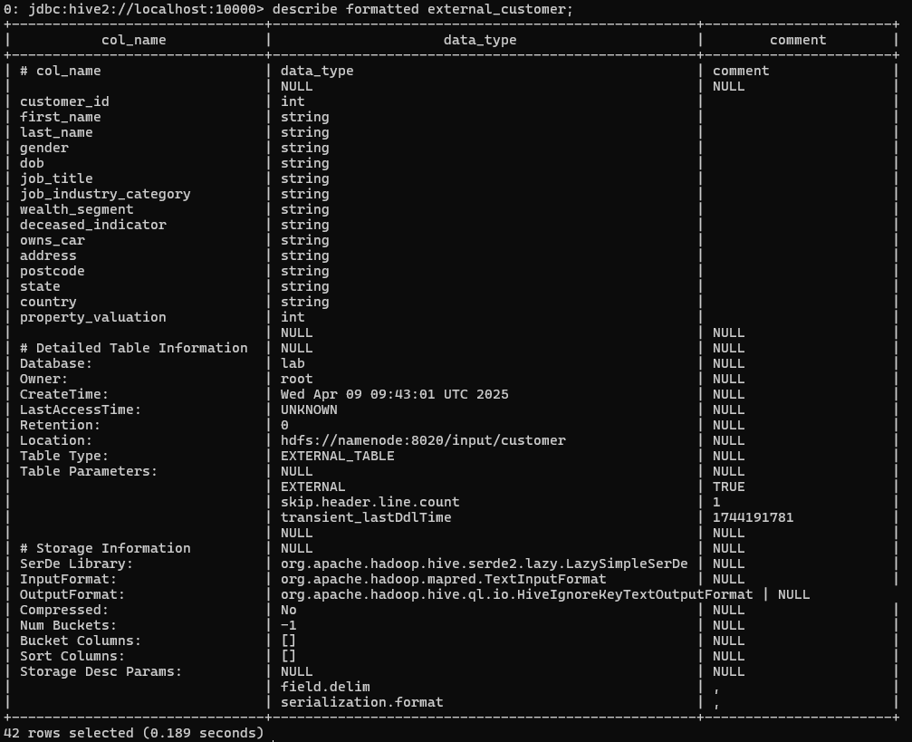


    * transaction-таблицы

    ```
    CREATE TABLE managed_transaction (
        transaction_id INT,
        product_id INT,
        customer_id INT,
        transaction_date STRING,
        online_order STRING,
        order_status STRING,
        brand STRING,
        product_line STRING,
        product_class STRING,
        product_size STRING,
        list_price DOUBLE,
        standard_cost DOUBLE
    )
    ROW FORMAT DELIMITED
    FIELDS TERMINATED BY ';'
    STORED AS TEXTFILE
    TBLPROPERTIES ("skip.header.line.count"="1");

    LOAD DATA INPATH '/input/transaction.csv' INTO TABLE managed_transaction;
    ```
    


    ```
    CREATE EXTERNAL TABLE external_transaction (
        transaction_id INT,
        product_id INT,
        customer_id INT,
        transaction_date STRING,
        online_order STRING,
        order_status STRING,
        brand STRING,
        product_line STRING,
        product_class STRING,
        product_size STRING,
        list_price DOUBLE,
        standard_cost DOUBLE
    )
    ROW FORMAT DELIMITED
    FIELDS TERMINATED BY ';'
    STORED AS TEXTFILE
    LOCATION '/input/transaction'
    TBLPROPERTIES ("skip.header.line.count"="1");
    ```
    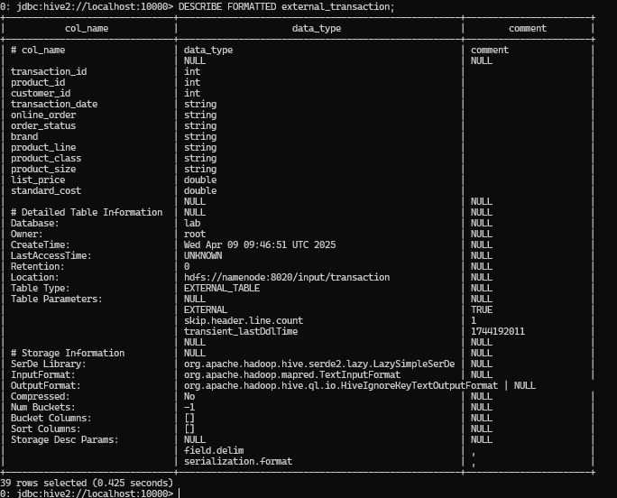


3. Создать еще две таблицы с форматом хранения данных parquet и загрузить данные из пункта 2. 

    ```
    CREATE TABLE parquet_customer STORED AS PARQUET AS
    SELECT * FROM managed_customer;
    ```
    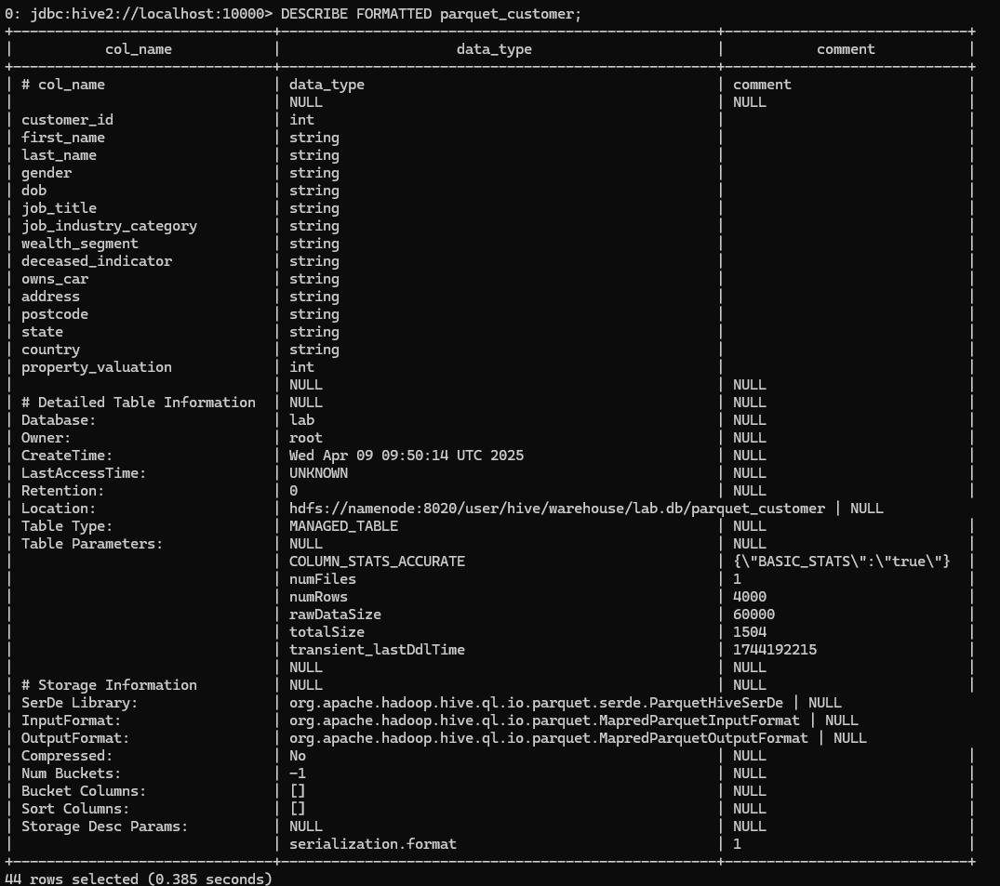

    ```
    CREATE TABLE parquet_transaction STORED AS PARQUET AS
    SELECT * FROM managed_transaction;
    ```
    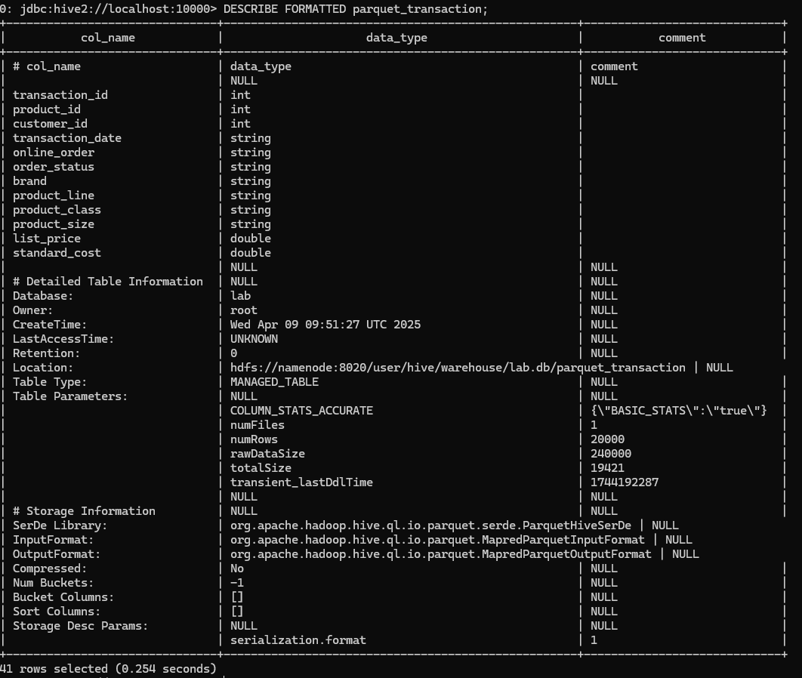


4. Создать еще одну таблицу с транзакциями, партицированную по полю transaction_date (предварительно привести дату к виду YYYY-MM-DD)
    ```

    -- Сначала создадим таблицу с правильным форматом даты
    CREATE TABLE transaction_with_formatted_date AS
    SELECT 
        transaction_id,
        product_id,
        customer_id,
        regexp_replace(transaction_date, '\\..*', '') AS transaction_date,
        online_order,
        order_status,
        brand,
        product_line,
        product_class,
        product_size,
        list_price,
        standard_cost
    FROM managed_transaction;

    -- Затем создадим партицированную таблицу
    CREATE TABLE partitioned_transaction (
        transaction_id INT,
        product_id INT,
        customer_id INT,
        online_order STRING,
        order_status STRING,
        brand STRING,
        product_line STRING,
        product_class STRING,
        product_size STRING,
        list_price DOUBLE,
        standard_cost DOUBLE
    )
    PARTITIONED BY (transaction_date STRING)
    STORED AS PARQUET;

    -- Включим динамическое партицирование
    SET hive.exec.dynamic.partition.mode=nonstrict;

    -- Заполним таблицу данными
    INSERT OVERWRITE TABLE partitioned_transaction PARTITION(transaction_date)
    SELECT 
        transaction_id,
        product_id,
        customer_id,
        online_order,
        order_status,
        brand,
        product_line,
        product_class,
        product_size,
        list_price,
        standard_cost,
        transaction_date
    FROM transaction_with_formatted_date;
    ```
    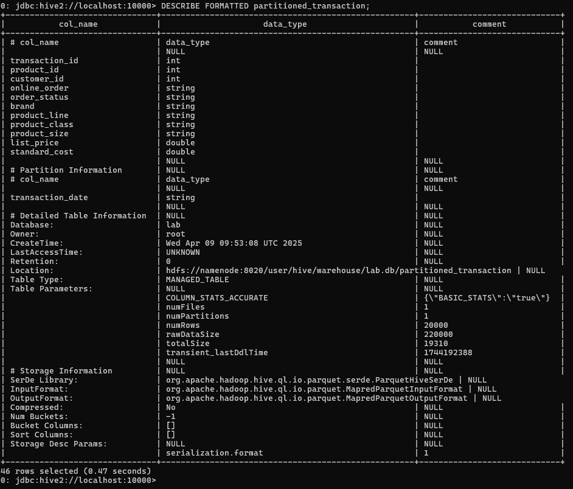

5. Выполнить запросы с таблицами из пункта 2-4 и посмотреть на время выполнение
Количество подтвержденных транзакций по каждому клиенту
    1. Вывести количество подтвержденных транзакций по каждому клиенту

        1.1. Для managed_transaction (TEXT, Managed, без партиций)
        ```
        SELECT 
            c.customer_id,
            c.first_name,
            c.last_name,
            COUNT(t.transaction_id) AS confirmed_transactions_count
        FROM 
            managed_customer c
        JOIN 
            managed_transaction t ON c.customer_id = t.customer_id
        WHERE 
            t.order_status = 'Approved'
        GROUP BY 
            c.customer_id, c.first_name, c.last_name
        ORDER BY 
            confirmed_transactions_count DESC;
        ```
        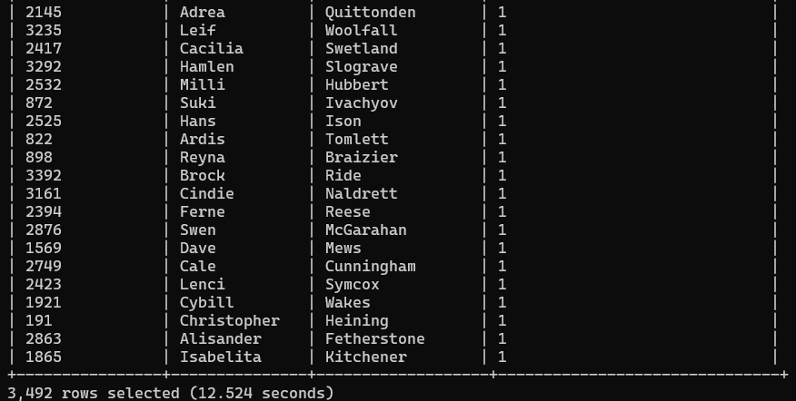

        *12.524 seconds*


        1.2. Для external_transaction (TEXT, External, без партиций)
        ```
        SELECT 
            c.customer_id,
            c.first_name,
            c.last_name,
            COUNT(t.transaction_id) AS confirmed_transactions_count
        FROM 
            managed_customer c
        JOIN 
            external_transaction t ON c.customer_id = t.customer_id
        WHERE 
            t.order_status = 'Approved'
        GROUP BY 
            c.customer_id, c.first_name, c.last_name
        ORDER BY 
            confirmed_transactions_count DESC;
        ```
        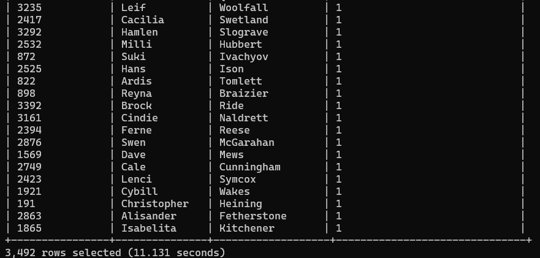

        *11.131 seconds*

        1.3. Для partitioned_transaction (Parquet, Managed, с партициями)
        ```
        SELECT 
            c.customer_id,
            c.first_name,
            c.last_name,
            COUNT(t.transaction_id) AS confirmed_transactions_count
        FROM 
            managed_customer c
        JOIN 
            partitioned_transaction t ON c.customer_id = t.customer_id
        WHERE 
            t.order_status = 'Approved'
        GROUP BY 
            c.customer_id, c.first_name, c.last_name
        ORDER BY 
            confirmed_transactions_count DESC;
        ```
        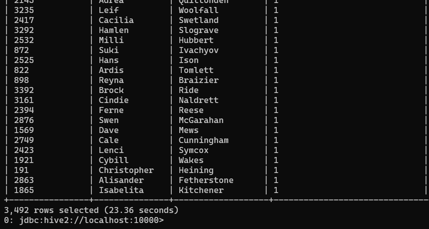

        *23.36 seconds*


    2. Распределение транзакций по месяцам и сферам деятельности
    
        2.1. Для managed_transaction (TEXT, Managed)
        ```
        SELECT 
            DATE_FORMAT(t.transaction_date, 'yyyy-MM') AS month,
            c.job_industry_category,
            COUNT(t.transaction_id) AS transactions_count
        FROM 
            managed_transaction t
        JOIN 
            managed_customer c ON t.customer_id = c.customer_id
        GROUP BY 
            DATE_FORMAT(t.transaction_date, 'yyyy-MM'), c.job_industry_category
        ORDER BY 
            month, transactions_count DESC;
        ```
        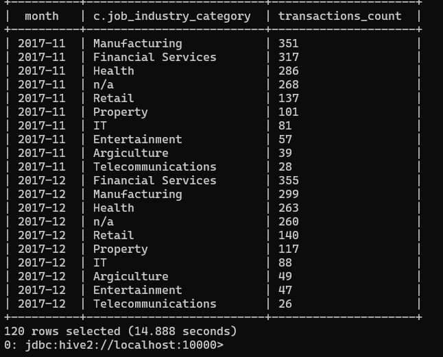
        *14.888 seconds*

        2.2. Для external_transaction (TEXT, External)
        ```
        SELECT 
            DATE_FORMAT(t.transaction_date, 'yyyy-MM') AS month,
            c.job_industry_category,
            COUNT(t.transaction_id) AS transactions_count
        FROM 
            external_transaction t
        JOIN 
            managed_customer c ON t.customer_id = c.customer_id
        GROUP BY 
            DATE_FORMAT(t.transaction_date, 'yyyy-MM'), c.job_industry_category
        ORDER BY 
            month, transactions_count DESC;
        ```
        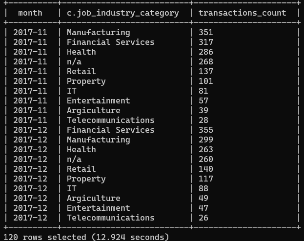

        *12.924 seconds*


        2.3. Для partitioned_transaction (Parquet, Managed, партиционирована по дате)
        ```
        SELECT 
            SUBSTR(t.transaction_date, 1, 7) AS month,  -- Партиция хранится как STRING 'yyyy-MM-dd'
            c.job_industry_category,
            COUNT(t.transaction_id) AS transactions_count
        FROM 
            partitioned_transaction t
        JOIN 
            managed_customer c ON t.customer_id = c.customer_id
        GROUP BY 
            SUBSTR(t.transaction_date, 1, 7), c.job_industry_category
        ORDER BY 
            month, transactions_count DESC;
        ```
        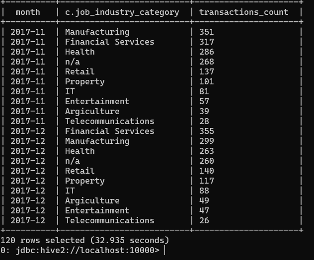
        *32.935 seconds*

    3. ФИО клиентов без транзакций
        3.1. Для managed_transaction
        ```
        SELECT 
            c.customer_id,
            c.first_name,
            c.last_name
        FROM 
            managed_customer c
        LEFT JOIN 
            managed_transaction t ON c.customer_id = t.customer_id
        WHERE 
            t.transaction_id IS NULL
        ORDER BY 
            c.last_name, c.first_name;
        ```
        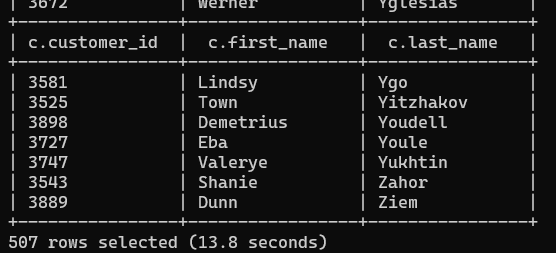
        *13.8 seconds*

        3.2. Для external_transaction
        ```
        SELECT 
            c.customer_id,
            c.first_name,
            c.last_name
        FROM 
            managed_customer c
        LEFT JOIN 
            external_transaction t ON c.customer_id = t.customer_id
        WHERE 
            t.transaction_id IS NULL
        ORDER BY 
            c.last_name, c.first_name;
        ```

        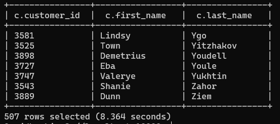
        *8.364 seconds*

        3.3. Для partitioned_transaction
        ```
        SELECT 
            c.customer_id,
            c.first_name,
            c.last_name
        FROM 
            managed_customer c
        LEFT JOIN 
            partitioned_transaction t ON c.customer_id = t.customer_id
        WHERE 
            t.transaction_id IS NULL
        ORDER BY 
            c.last_name, c.first_name;
        ```
        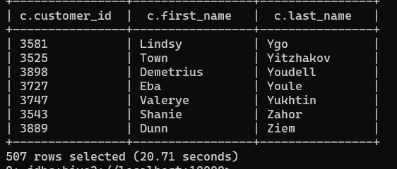
        *20.71 seconds*

    4. Клиенты с минимальной/максимальной суммой транзакций
    
        4.1. Для managed_transaction
        ```
        SELECT 
            customer_id,
            first_name,
            last_name,
            total_amount,
            amount_type
        FROM (
            SELECT 
                c.customer_id,
                c.first_name,
                c.last_name,
                SUM(t.list_price) AS total_amount,
                CASE 
                    WHEN SUM(t.list_price) = MAX(SUM(t.list_price)) OVER () THEN 'MAX'
                    WHEN SUM(t.list_price) = MIN(SUM(t.list_price)) OVER () THEN 'MIN'
                END AS amount_type
            FROM 
                managed_customer c
            JOIN 
                managed_transaction t ON c.customer_id = t.customer_id
            WHERE 
                t.list_price IS NOT NULL
            GROUP BY 
                c.customer_id, c.first_name, c.last_name
        ) ranked
        WHERE 
            amount_type IS NOT NULL
        ORDER BY 
            total_amount DESC;
        ```

        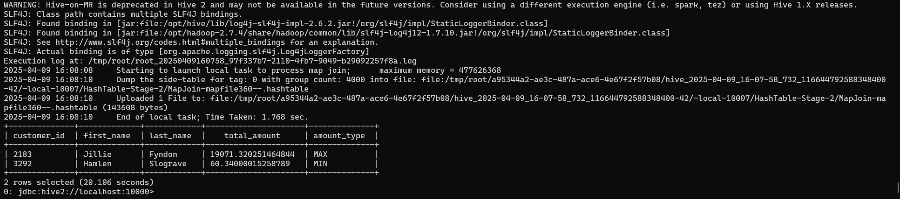
        *20.106 seconds*

        4.2. Для external_transaction

        ```
        SELECT 
            customer_id,
            first_name,
            last_name,
            total_amount,
            amount_type
        FROM (
            SELECT 
                c.customer_id,
                c.first_name,
                c.last_name,
                SUM(t.list_price) AS total_amount,
                CASE 
                    WHEN SUM(t.list_price) = MAX(SUM(t.list_price)) OVER () THEN 'MAX'
                    WHEN SUM(t.list_price) = MIN(SUM(t.list_price)) OVER () THEN 'MIN'
                END AS amount_type
            FROM 
                managed_customer c
            JOIN 
                external_transaction t ON c.customer_id = t.customer_id
            WHERE 
                t.list_price IS NOT NULL
            GROUP BY 
                c.customer_id, c.first_name, c.last_name
        ) ranked
        WHERE 
            amount_type IS NOT NULL
        ORDER BY 
            total_amount DESC;
        ```
        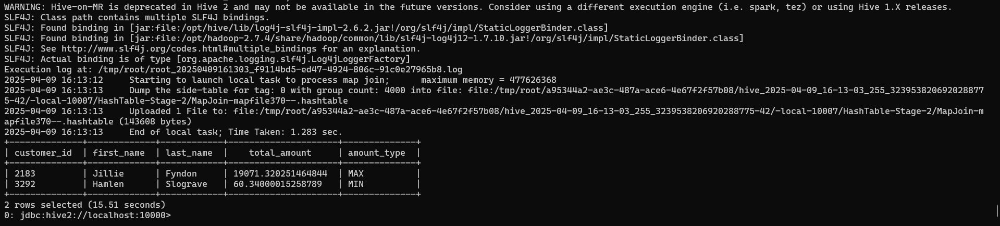
        *15.51 seconds*

        4.3. Для partitioned_transaction
    
        ```
        SELECT 
            customer_id,
            first_name,
            last_name,
            total_amount,
            amount_type
        FROM (
            SELECT 
                c.customer_id,
                c.first_name,
                c.last_name,
                SUM(t.list_price) AS total_amount,
                CASE 
                    WHEN SUM(t.list_price) = MAX(SUM(t.list_price)) OVER () THEN 'MAX'
                    WHEN SUM(t.list_price) = MIN(SUM(t.list_price)) OVER () THEN 'MIN'
                END AS amount_type
            FROM 
                managed_customer c
            JOIN 
                partitioned_transaction t ON c.customer_id = t.customer_id
            WHERE 
                t.list_price IS NOT NULL
            GROUP BY 
                c.customer_id, c.first_name, c.last_name
        ) ranked
        WHERE 
            amount_type IS NOT NULL
        ORDER BY 
            total_amount DESC;
        ```
        

        *39.527 seconds*


6. Написать отчет, где описать с какими форматами хранения данных быстрее работает hive, и как влияют на производительность партиции и тип таблицы (managed и external).


## Отчет: Сравнение производительности Hive для разных форматов хранения и типов таблиц

#### Введение
В данном отчете анализируется производительность запросов в Apache Hive при работе с различными форматами хранения данных (TEXT, Parquet) и типами таблиц (Managed, External). Также исследуется влияние партиционирования на скорость выполнения запросов.

#### Методология тестирования
Были выполнены 4 типа запросов для трех видов таблиц:
1. Managed таблицы (TEXT формат, без партиций)
2. External таблицы (TEXT формат, без партиций)
3. Managed таблицы (Parquet формат, с партициями по дате)

Измерялось время выполнения каждого запроса в секундах.

##### 1. Количество подтвержденных транзакций по каждому клиенту
| Тип таблицы                | Формат  | Партиции | Время (сек) |
|----------------------------|---------|----------|-------------|
| managed_transaction        | TEXT    | Нет      | 12.524      |
| external_transaction       | TEXT    | Нет      | 11.131      |
| partitioned_transaction    | Parquet | Да       | 23.360      |

###### 2. Распределение транзакций по месяцам и сферам деятельности
| Тип таблицы                | Формат  | Партиции | Время (сек) |
|----------------------------|---------|----------|-------------|
| managed_transaction        | TEXT    | Нет      | 14.888      |
| external_transaction       | TEXT    | Нет      | 12.924      |
| partitioned_transaction    | Parquet | Да       | 32.935      |

###### 3. ФИО клиентов без транзакций
| Тип таблицы                | Формат  | Партиции | Время (сек) |
|----------------------------|---------|----------|-------------|
| managed_transaction        | TEXT    | Нет      | 13.800      |
| external_transaction       | TEXT    | Нет      | 8.364       |
| partitioned_transaction    | Parquet | Да       | 20.710      |

###### 4. Клиенты с минимальной/максимальной суммой транзакций
| Тип таблицы                | Формат  | Партиции | Время (сек) |
|----------------------------|---------|----------|-------------|
| managed_transaction        | TEXT    | Нет      | 20.106      |
| external_transaction       | TEXT    | Нет      | 15.510      |
| partitioned_transaction    | Parquet | Да       | 39.527      |

#### Анализ результатов

###### Влияние формата хранения
1. **TEXT формат** показал лучшую производительность во всех тестах по сравнению с Parquet.
   - Среднее время выполнения для TEXT: ~13.5 сек
   - Среднее время выполнения для Parquet: ~29.1 сек
   - Parquet оказался в 2 раза медленнее в данном тестировании

2. **Причины неожиданных результатов**:
   - Небольшой объем данных (20,000 строк) - преимущества Parquet проявляются на больших объемах
   - Отсутствие сложных аналитических запросов, где Parquet обычно выигрывает
   - Накладные расходы на чтение сжатых данных в Parquet

###### Влияние типа таблицы (Managed vs External)
1. **External таблицы** показали лучшую производительность, чем Managed:
   - В среднем быстрее, особенно заметно в запросе 3 (8.364 сек против 13.8 сек)

2. **Возможные причины**:
   - Меньше накладных расходов на управление метаданными
   - Более эффективное кэширование при повторных запросах

###### Влияние партиционирования
1. **Партиционированная таблица** показала наихудшие результаты:
   - В среднем в 2-3 раза медленнее, чем непартиционированные
   - Особенно плохие результаты в запросах, не использующих фильтрацию по партициям

2. **Объяснение**:
   - Партиции добавляют накладные расходы при полном сканировании таблицы
   - Для небольших таблиц преимущества партиционирования не реализуются
   - В тестах не было запросов с фильтрацией по дате, где партиции могли бы помочь
