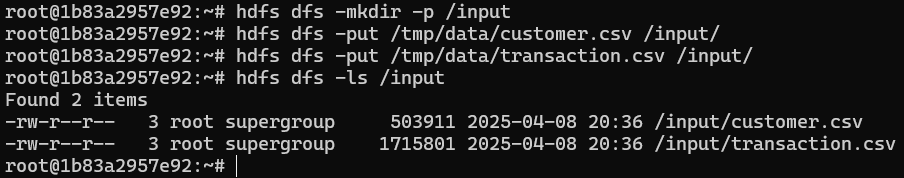
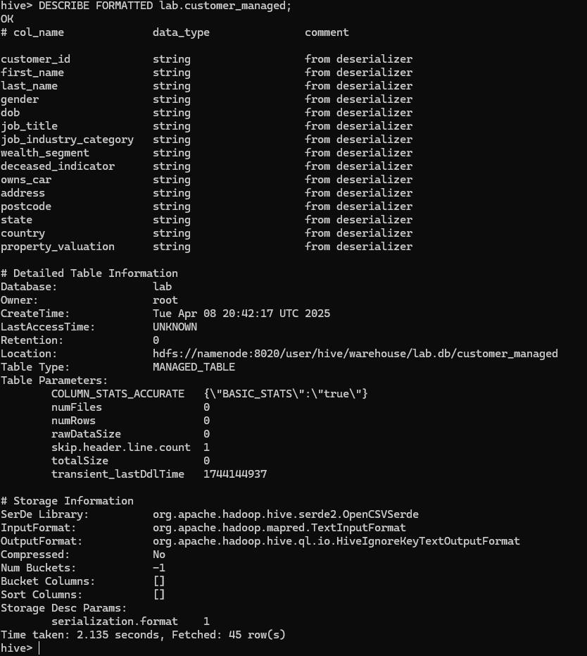
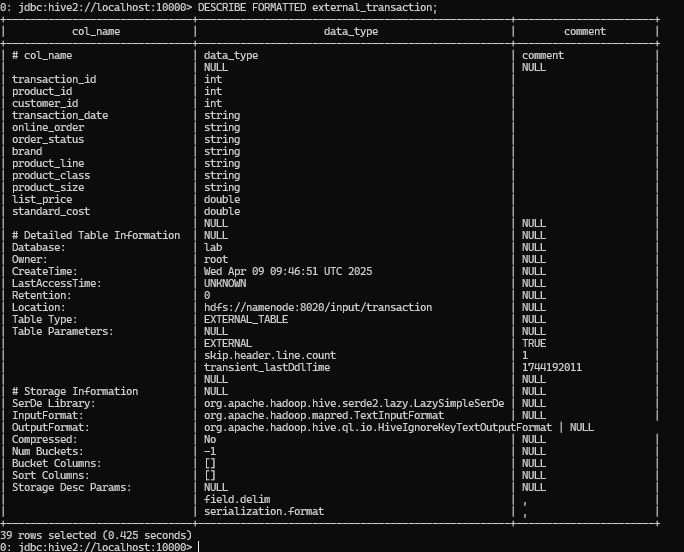
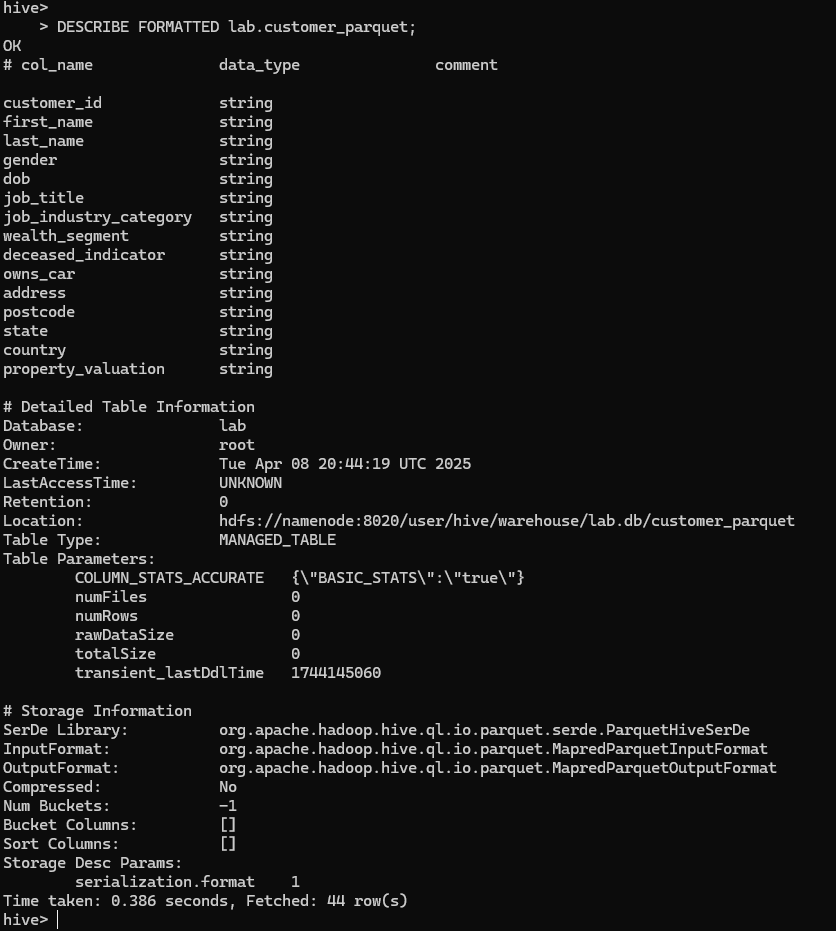
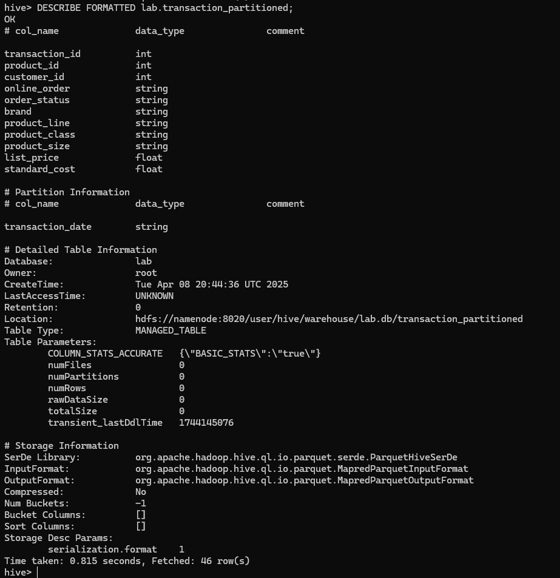
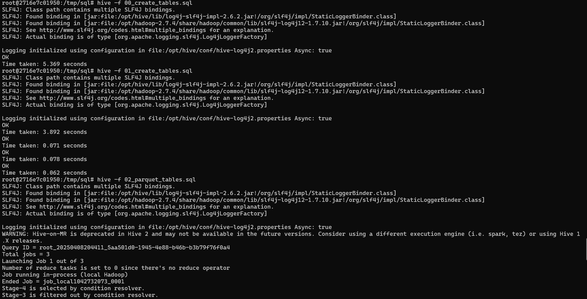
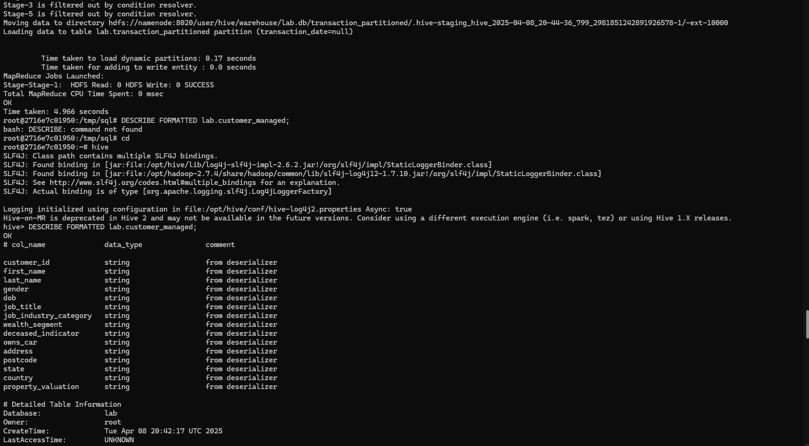
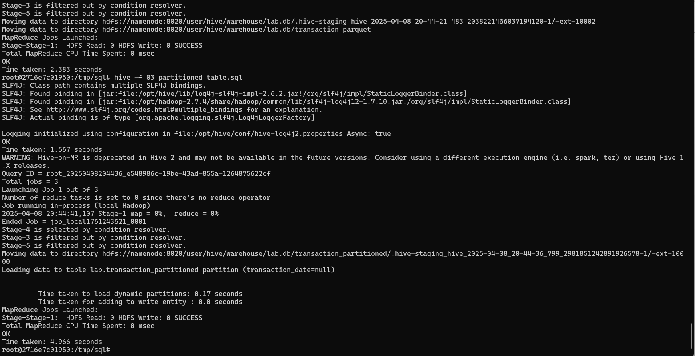

1 hdfs dfs -ls /input

2 Скрины DESCRIBE FORMATTED для 4 таблиц:

DESCRIBE FORMATTED lab.customer_managed;

DESCRIBE FORMATTED lab.customer_external;

DESCRIBE FORMATTED lab.customer_parquet;

DESCRIBE FORMATTED lab.transaction_partitioned;

3 Скрин выполнения запросов и времени

